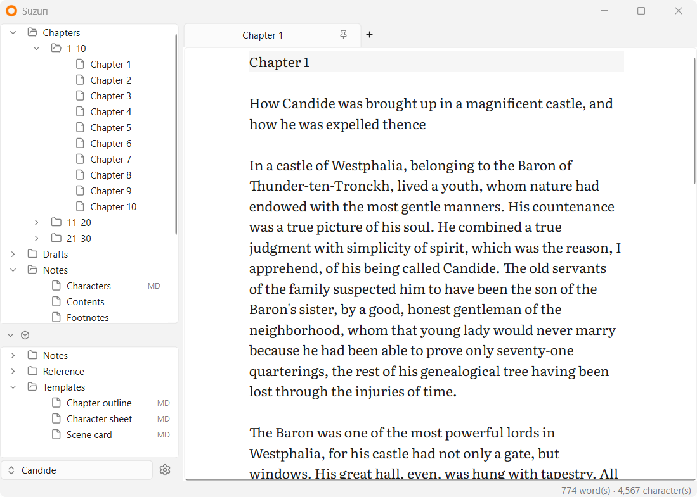

    
     
    <b>A plain-text editor for creative writing</b>

    
    
    
     
    
     
    <a href="https://github.com/fairybow/Suzuri/releases"><b>Releases</b></a> •
    <a href="Suzuri/docs"><b>Documentation</b></a>

    &nbsp
     
    
     
    &nbsp

## About

I'm a writer, and Suzuri is a personal project: the writing app I've wanted for myself.

Its design is based on [Obsidian](https://obsidian.md/), where a vault is just a folder on your computer. But Suzuri is meant for novel writing, and everything you write stays in plain-text files you own and can open in any editor.

Suzuri is early in development, and more features are planned. I expect to keep working on it for a long time.

> [!WARNING]
> Suzuri hasn't reached 1.0 yet. Keep regular backups of your work.

*Suzuri is an independent project and isn't affiliated with or endorsed by Obsidian.*

## Support

I enjoy working on Suzuri, and I'm genuinely grateful for any support. You can do that [here](https://ko-fi.com/fairybow).

But if you're going to give anywhere, I'd rather you please give to [United24 🇺🇦](https://u24.gov.ua/) and help defend Ukraine. Civilians there are under attack every day, and your money will do far more good that way.