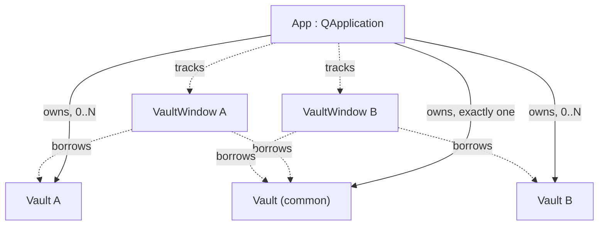
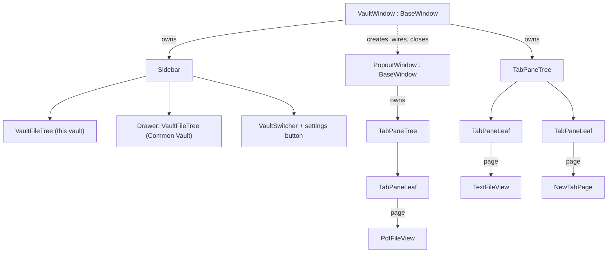
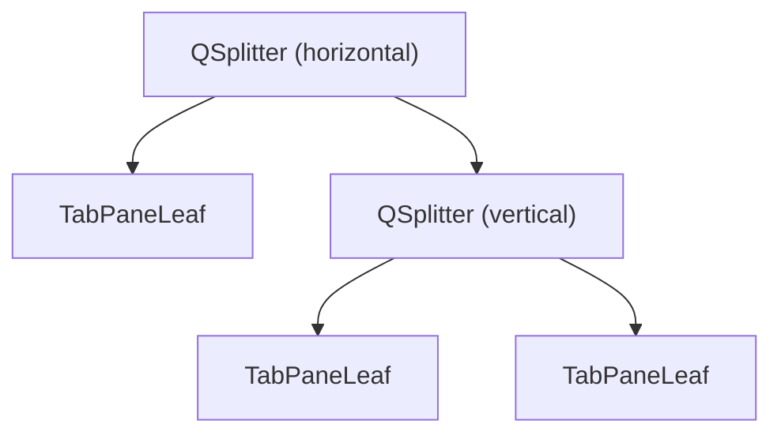
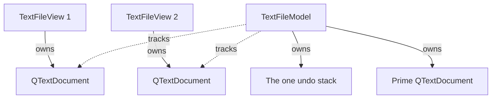
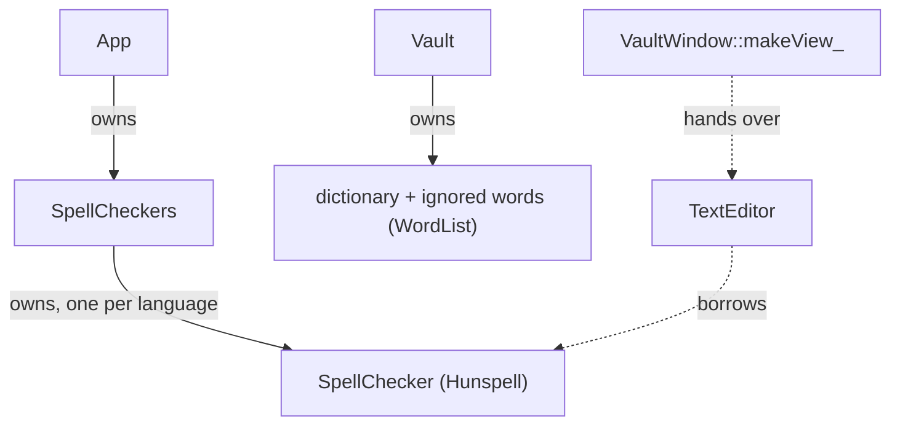

# Architecture

How Suzuri is put together, and why. For what it does, see [Features.md](Features.md); for what it doesn't do yet, [Future.md](Future.md); for code conventions, [CodeStyle.md](CodeStyle.md).

This document covers what spans several files: who owns what, what is guaranteed, and the reasoning that no single header can hold. Each class's own header comment covers the rest.

## Principles

Two rules decide most questions, in this order:

1. **Sane.** Conventional C++ and Qt. Code should be predictable to anyone who knows the language and the framework.
2. **Simple.** Nothing more complex than the problem requires. No abstraction, indirection, or generality without a concrete consumer.

When the two conflict, sane wins.

Four structural commitments follow from them:

- **No off-disk buffers.** Every open document is a file that exists on disk. This is what makes unconditional autosave possible, and it removes save prompts, modified markers, and untitled-document naming.
- **No singletons and no service locator.** "Only one exists" and "reachable from anywhere" are different properties. Each object is owned by whatever owns the data it describes, and is handed to whoever needs it.
- **No signal relays.** A signal is emitted by the object that owns the fact. It is not echoed up a chain of parents. Where an action belongs to a distant owner, the owner creates the action and hands the pointer down.
- **One process.** `App` is a `QApplication`, and every open vault lives inside it. A second launch hands its arguments to the running instance and exits.

Obsidian is the behavioral reference. Where Suzuri's intended behavior is unclear, Obsidian's is looked up and either matched or diverged from on purpose. The divergences are listed in [Features.md](Features.md).

## Source layout

Everything is under `Suzuri/src/`, in the `Suzuri` namespace. Apart from `Main.cpp`, the code is header-only. The tests sit beside it in `Suzuri/tests/`; see "Tests" in [CodeStyle.md](CodeStyle.md).

| Folder | Holds |
|---|---|
| `src/` | `Main.cpp`, `App`, and the log window |
| `core/` | `Vault`, the vault tree model, configuration, file IO, file types, action ids |
| `core/spell/` | Spellcheck: the dictionaries, the word rules, and the vault's word lists |
| `models/` | One buffer class per file type, and the prime document |
| `views/` | One view class per file type, and the parts only views use: the text editor with its selection handles, the find bar and the search functions behind it, and the zoom control with its state |
| `ui/` | The windows and what they open directly: workspace persistence, Go to File, the vault picker, the status bar items |
| `ui/tabs/` | The split tree, its leaves, the tab bar and its buttons, the new-tab page |
| `ui/sidebar/` | The sidebar, the file trees, the common drawer, the vault switcher |
| `ui/settings/` | The settings dialog, its pages, and their rows |
| `ui/widgets/` | Controls that know nothing of the app: glyph rendering, the toggle switch, the slider, name checking, the row labels shared by the file tree and Go to File |

Folders are for finding files; they don't set namespaces. Everything under `ui/` is in `Suzuri::Ui`, whatever its subfolder; everything else is in `Suzuri`.

Includes run one way, from the top of this list down:

- `App` includes anything.
- `ui/` includes `views/`, `models/`, and `core/`.
- `views/` includes `models/` and `core/`. From `ui/` it takes only `ui/widgets/`.
- `ui/widgets/` takes nothing from the app but `ui/UiConstants.h`, which itself includes nothing of Suzuri's.
- `core/` and `models/` include each other, and nothing from `views/` or `ui/`.

`Vault` and everything it owns create no window or widget and refer to none, so the data layer can't come to depend on one. They are not limited to QtCore: a text buffer is a `QTextDocument` with a plain-text layout (QtGui and QtWidgets), an image buffer holds a `QPixmap`, and a PDF buffer a `QPdfDocument`. `VaultTreeModel` and the configuration types are QtCore only.

[Coco](https://github.com/fairybow/Coco), a submodule, supplies paths (`Coco::Path`), logging, debounce timers, and the single-instance guard. [Hunspell](https://github.com/hunspell/hunspell), also a submodule and pinned to a release tag, checks spelling. It has no CMake build of its own, so Suzuri's CMake builds its sources as a static library, with its warnings off.

## Ownership

| Owner | Owns |
|---|---|
| `App` | The common `Vault`, every project `Vault`, `AppConfig`, the app-wide actions, the spelling dictionaries (`SpellCheckers`). Tracks each `VaultWindow` and the `ManageVaults` window |
| `Vault` | Its file buffers, a watcher over its open files, its `VaultTreeModel`, its `VaultConfig`, its dictionary and ignored words, its `.suzuri/` folder |
| `BaseWindow` | The window's `TabPaneTree`, its action registry, its status bar |
| `VaultWindow` | Its `Sidebar`, its `WorkspaceFile`, its settings dialog, and the creation of its pop-outs. Borrows two vaults |
| `PopoutWindow` | Nothing of its own. Its `VaultWindow` wires it |

**`App` owns every `Vault`.** If windows owned their vaults, `Vault` would have two kinds of owner: `App` for the common one, a window for the rest. Owning them all in one place makes the Common Vault an ordinary `Vault` that happens to have no window.

**One `Vault` per folder.** `App` enforces it. The Common Vault can be opened as a window of its own, and that window is given the `Vault` that `App` already holds. A second `Vault` over the same folder would mean two buffers for one file, each autosaving over the other. Because of this, "is this window the Common Vault's own?" is a pointer comparison everywhere it is asked.

**Windows are tracked, not owned.** They are parentless top-level widgets that delete themselves on close. `App` holds pointers to them and reacts to their `destroyed` signal.

## Lifetimes

These rules are easy to break and expensive to rediscover.

- **`destroyed` arrives from a half-dead object.** It is emitted from `~QObject`, after the derived parts are gone, so the sender can't be cast back to its type. A handler that needs to know which window died captures the key (the vault's path) in the connection.
- **A `Vault` is disposed with `deleteLater`, never `delete`.** `destroyed` is emitted before the object's children are deleted, so the window's views may still be alive and holding the vault's buffers. Deferring puts the vault's deletion after the window is fully gone.
- **The common `Vault` is never disposed by a window closing.** It belongs to `App` and other windows still hold its buffers.
- **Buffers watch `destroyed`; views don't call back.** A buffer counts its views by connecting to each one's `destroyed`. No view destructor calls into its buffer, so teardown order doesn't matter.
- **A view always outlives its reach into the vault.** A window and its views are destroyed a full event-loop pass before its vault is. At quit, Qt destroys top-level windows before `App`'s children. So the last view closing always finds a live `Vault`.
- **`App` decides when to quit.** Quit-on-last-window is off. The app quits when no vault window is open and the vault picker isn't up.
- **Quit goes through each window's close.** The Quit action closes each vault window in turn and stops at the first refusal. It never calls `quit()` directly, which would skip the final save and the chance to refuse.
- **Pop-outs are siblings of their vault window,** not Qt children: a child window can never be stacked behind its parent. The vault window keeps a list of its pop-outs and closes them itself.
- **Raw pointers are the default.** A pointer that can outlive its target is cleared from that target's `destroyed`. On the single GUI thread this is equivalent to `QPointer`.
- **Nothing is logged during `App`'s construction.** Logging starts in `App::init`.

## Windows and views

- **`BaseWindow`** is what both window types share: a `TabPaneTree`, the action registry, the status bar, and the actions any window can perform itself (undo, redo, zoom).
- **`VaultWindow`** adds the sidebar, file opening, workspace persistence, and the settings dialog. It is the only place pop-outs are created, and it wires every pop-out's tree the same way it wires its own.
- **`PopoutWindow`** adds nothing. It has no close logic, because it has no state: buffers live in the `Vault`.

### The composition rule

`VaultWindow` composes components and never reaches inside them. Each component handles its own interaction and emits a signal that states intent: the file tree emits "open this path" or "rename this to that", and the sidebar routes it to the vault that owns the path. If the window ever reads a component's internals, the rule is broken.

This is what keeps a main window from accumulating one method per interaction in the app.

### Pages

A tab's content is a page, and a page is a plain `QWidget`. `TabPaneLeaf` and `TabPaneTree` never learn what kind of page they hold.

- A file view is an `AbstractFileView`, one view of one file. Each file type has its own subclass.
- A new tab holds a `NewTabPage`. It is not a file view: a tab with no file has no buffer, and a placeholder buffer would be exactly the off-disk buffer the design rules out. Choosing a file replaces the page in place.
- What a tab needs from its page travels on the page widget: the title is its window title, and pin state and the tab icon are properties read through small helper headers. They follow the page through reorders, drags between panes and windows, and restore, with nothing else carrying them.
- Anything that asks "which file is in this tab?" casts the page to `AbstractFileView` and handles null.

`TextFileView` can't itself be a `QPlainTextEdit`, since views share the `AbstractFileView` base. It holds one: `TextEditor`, a `QPlainTextEdit` subclass that draws the line-number gutter, margins, highlight, and selection handles.

## The split tree

`TabPaneTree` is the pane area of a window: nested `QSplitter`s as branches, `TabPaneLeaf`s as leaves, each leaf holding a tab bar and its pages.

- **The tree is a widget that owns its root splitter; it is not the root itself.** Splitting the root against its orientation means wrapping it in a new splitter. Owning the root lets it be swapped while the window's central widget, and every pointer to it, stays put.
- **Split.** A split in the splitter's own orientation adds a pane beside the target, halving only the target's space. A split across it wraps the target in a new splitter.
- **Collapse.** A leaf with no tabs is removed, unless it is the last one. A splitter left with one child is unwrapped. Skipping this leaves invisible one-child splitters that corrupt saved layouts.
- **The active leaf follows keyboard focus.** The tree watches application focus changes and ignores any outside itself, so leaves need no "I'm active" signal and each window's tree is independent.
- **A window focuses its active page on first show.** A hidden widget can't take focus, so focusing pages during restore does nothing. `BaseWindow` does it once the window is shown.
- **A tab press focuses its page after the bar handles it.** `QTabBar::tabBarClicked` fires before the bar changes the current tab, and the change moves focus again, so `TabBar` emits its own `tabPressed` afterward.
- **The tree reports its active page.** The status bar follows that signal, not focus, because closing a tab or restoring a layout doesn't reliably move focus.
- **Restore builds a detached tree and swaps it in at the end.** Collapse handling is suspended during a restore; otherwise the half-built tree reports itself empty, which closes a restoring pop-out before it is shown.

### Dragging tabs

A tab drag uses Qt's drag and drop for one thing: delivering drop events across top-level windows. Nothing is serialized.

- The drag's payload is a marker. The target reads the dragged page from the source tree, which Qt provides for a drag within one process.
- The page moves only when a drop is accepted. Until then the source tab stays where it is, so the source pane is never empty mid-drag.
- A drag is valid only within one vault's window family: the vault window and its pop-outs. Each tree carries its family's identity, and a drop on another family's window is refused.
- A drop that no pane accepts pops the tab out into a new window.
- Drop zones are a pane's tab bar (add the tab), its four edges (split), and its center (currently the same as no zone).

A file dragged from a file tree uses a separate private format carrying absolute paths. The tree views accept it to move an entry; the split tree accepts it, files only, to open one. Because the format is private, nothing can be dragged out of the app.

## Documents

### One buffer per file

Each `Vault` keeps one buffer for each of its open files, keyed by the file's path relative to the vault. Every view of that file, in any tab, pane, or window, shares it. Since every window borrows the same common `Vault`, a Common Vault file open in two project windows is one buffer, and live sync between windows needs no mechanism of its own.

A buffer is freed when its last view closes, after a final save. If that save fails, the buffer is kept.

Closing a tab does no file IO. It destroys a view, not a buffer.

### File identity

A file is identified by a `FileRef`: a vault and a path relative to it. A bare path isn't enough, because one window reaches two vaults. `Vault::makeFileRef` is the single place an absolute path becomes a `FileRef`.

The file tree hands out absolute paths and never a `FileRef`; the sidebar knows which vault each tree belongs to.

### Buffers

`AbstractFileModel` is the base: its `FileRef`, its bytes in and out, modified state, undo, and the view count. A buffer does no file IO. The `Vault` reads bytes and gives them to the buffer, and takes bytes from it to write.

| Class | Holds |
|---|---|
| `TextFileModel` | The prime document, the file's line ending style and byte order mark |
| `PdfFileModel` | The file's bytes and one parsed PDF document, shared by every view |
| `ImageFileModel` | The file's bytes and one decoded image, shared by every view |

Which class a file gets is decided by its extension, from one table in `core/FileTypes.h`. The same table decides what the file trees and Go to File list, so they can't disagree with what the vault will open. `Vault::openModel` refuses anything not in the table before reading it; that refusal is the authority, and the hiding upstream is a courtesy.

PDF and image buffers share no base beyond `AbstractFileModel`. What they have in common is one byte array.

### The prime document

Qt gives a text document one layout, and an editor installs its own. Two editors on one document would share one layout, and so one wrap width. Qt has no supported way around this.

So each text view owns a document of its own, and the buffer owns one more, the prime, which no view displays. An edit in any view's document is applied to the prime and to every other view's document.

- The prime belongs to no view, so closing any view, in any order, leaves the content intact.
- Applying an edit to another view's document makes that document report an edit too. A guard around the fan-out stops the echo.
- Undo lives on the prime alone. View documents have undo disabled; otherwise each view would undo only its own edits and the views would drift apart. The editor gives up the undo and redo keys so the window's actions handle them, and those actions reach the active view's buffer.
- A reload is its own undo step. Qt folds an insertion into the one before it when the two touch and the document is marked modified, so text typed at the end of reloaded text would otherwise undo together with the reload. `TextFileModel` clears the modified flag straight after a reload, because the buffer matches disk again, and that is also what keeps the two apart.
- After every routed change the prime checks each view's document against its own and resets one that differs, since the prime is what gets saved. Every build compares lengths; a debug build compares the text too. Nothing known causes a difference.
- Find and replace work in one view's document. A replacement is an edit there like any other, so it reaches the prime and the other views the same way. Replace all is one edit block, which a document reports as one change, so it is one undo step.
- Text is read from a document through a lossless path. Qt's plain-text accessor rewrites no-break spaces and some separators, which would silently change a file on its first save. Copying follows the same rule: the editor builds the clipboard's text itself, as plain text only, since Qt's own copy makes the same rewrites and adds rich formats.

## Saving

Nothing here is user-facing. There is no modified marker and no save command. A buffer's modified flag exists only so a save pass can skip buffers that already match disk.

### One write site

Every save, whatever triggered it, goes through one private function in `Vault`. That is where the write is fingerprinted for the watcher, where a failure is logged, and where a missing file is detected. A failed write leaves the buffer modified, so the next trigger retries it.

| Trigger | Where |
|---|---|
| Typing | `Vault`: one debounce and one ceiling timer for the whole vault |
| App loses focus | `App` |
| A window closes | `VaultWindow`, before it accepts the close |
| Quit | `App`. The common `Vault` has no window, so nothing else would save it |
| OS logout | `App`. Logout never delivers a close event |
| A buffer's last view closes | `Vault` |

The debounce restarts on every edit and fires when typing pauses. The ceiling starts once per burst and is never restarted, so it still fires under input that never pauses. Whichever fires first saves every modified buffer. One pair per vault is enough: one writer types one burst at a time.

### A save never creates

A buffer's file is always on disk. If it is missing at save time, it was deleted or moved outside Suzuri and the watcher hasn't said so yet. The save writes nothing, creates no folders, and hands the path to the watcher's reconcile, which closes the buffer. This is not reported as a save failure.

The same rule holds one level up: a workspace save never creates a missing vault folder.

File IO takes an explicit create-folders argument at every call. Only configuration writes, whose folders may not exist yet, pass yes.

### Save failure

Automatic saves log a failure and retry. A window close is the one moment a failure is both visible and still refusable: the window lists the files and stays open.

### Byte-faithful text

A text file is written back as it was read, apart from the user's edits. The prime document holds only `\n` and no byte order mark; `TextFileModel` records both on load and restores them on the way out. The one exception is a file that wasn't valid UTF-8 and that the user chose to open anyway: it is rewritten as UTF-8 at once, so the question never needs asking again.

## Watching the filesystem

A `Vault` has two watchers, because they track different things with different lifetimes.

- **The buffer watcher** watches each open file, for as long as it is open.
- **The tree model's watcher** watches each folder a tree view has listed.

### Open files

Change events are collected and handled together a moment later, so a Git checkout that rewrites many files is one pass.

For each changed path:

- **Gone:** the buffer is discarded and its views close themselves, in every window.
- **Bytes equal to what Suzuri last wrote:** ignored. The vault records a hash of each write, and compares disk against that hash, not against the live buffer, which typing may have moved on.
- **Bytes equal to the buffer:** ignored.
- **Anything else:** reloaded into the buffer as one undoable edit.

Two details matter on every platform. Many programs save by writing a temporary file and renaming it, which drops the path from the watcher, so a path is re-added after any change. And the vault's own saves work the same way, so the watch is removed around each write and restored after.

### Vault folders

When Suzuri becomes the active application again, `App` checks that every open vault's folder still exists. A missing project vault has its window closed; a missing Common Vault folder is recreated. The watchers aren't relied on for this: whether a folder's own removal is reported varies by platform.

## The vault tree model

`VaultTreeModel` is one model per vault, owned by the `Vault`. Every tree view of that vault sits on it: the vault's own tree, and for the Common Vault the drawer in every window. Expansion and selection belong to each view.

**Why the vault owns it.** On Windows, a watched folder is an open handle, and a handle on a folder blocks renaming, moving, or deleting any folder above it. Qt's own file system model keeps a private watcher with no way to release a folder, so one model per tree view meant Suzuri's own folder operations failed whenever any tree had listed a subfolder. Owning the model gives the `Vault` control of the watcher that holds the handles.

- **Listing is lazy and synchronous.** A folder is read the first time a view asks for its children.
- **The watched set is the listed set.** There is no separate record.
- **Hidden and unsupported entries are never listed,** so they are never watched. Nothing under `.git/` holds a handle.
- **A node stores only its name.** A path is built by walking up to the root, so renaming or moving a folder changes one node.
- **Outside changes re-list the folder as a diff.** Unchanged entries keep their nodes, so views keep their expansion and selection. A re-list that finds nothing to do is harmless, so the model needs no suppression of its own writes.
- **Suzuri's own operations update the model directly.** Before a rename, move, or delete, the vault releases the watches at or under the entry; afterward it moves or removes the node itself. A moved folder's node is the same object, so it stays expanded in every view.
- **Paths are typed.** Views read a `Coco::Path` and an is-folder flag from the model, not Qt item roles.

Outside programs are still blocked from renaming a folder that Suzuri has listed a subfolder of. See "Watching a whole vault through one handle" in [Future.md](Future.md).

## Identity

**A vault is its path.** Nothing identifying is stored in the vault folder. The known-vaults list, the open-vaults map in `App`, and saved workspaces all resolve by path. This matches Obsidian, whose vault ids are opaque handles in a per-machine file.

The cost is that a moved vault is a new vault. The benefit is that a copied vault folder is simply a second vault, with nothing to collide.

Paths are compared as values, element by element, so slash direction and repeated slashes don't matter. A trailing slash, `.` and `..` segments, relative paths, letter case on Windows, and symlinks do. Paths from the folder picker and from the known-vaults list are already clean; command-line arguments are the one input that will need normalizing. `Coco::Path` is deliberately not canonical on construction: that would make it impossible to name a path that doesn't exist yet, and would put a filesystem call in a value type.

**`Vault` takes only plain paths.** A plain path is a list of names: no `.` or `..` segment and no trailing slash (`Coco::Path::isPlain`). Because paths are compared as written, `<vault>/a/../..` reads as under the vault it climbs out of, and `a/./b` is a second key for the buffer at `a/b`. So every public `Vault` function that takes a path refuses one that isn't plain, and never normalizes it:

- An absolute path must be plain and at or under the root. `Vault::contains` is that test, and creating, renaming, moving, and trashing all answer to it.
- A vault-relative key must be non-empty, plain, and without a root (`/a` and, on Windows, `C:a` both replace part of the root when appended to it). `Vault::openModel` refuses anything else, which covers a path read from a hand-edited `workspace.json`.
- A rename's new name must be a single name.

`relativePathOf`, `absolutePathOf`, and `makeFileRef` only convert; a caller holding a path from outside checks `contains` first. The vault's own root is assumed plain.

## Configuration and persistence

All of it but a vault's dictionary is JSON, read and written by stateless free functions (`core/JsonIo.h` over `core/Io.h`, which writes atomically). A missing or unreadable file reads as an empty object, so callers fall to their defaults.

| What | File | Type | Owner |
|---|---|---|---|
| Known vaults, session, last-used folder | `suzuri.json` in the app data folder | `AppConfig` | `App` |
| Per-vault settings | `.suzuri/settings.json`, `.suzuri/appearance.json` | `VaultConfig` | `Vault` |
| Window and tab layout | `.suzuri/workspace.json` | `WorkspaceFile` | `VaultWindow` |
| A vault's dictionary | `.suzuri/dictionary.txt`, one word per line | `WordList` | `Vault` |

- **Each config type holds its own defaults.** A missing key falls to the default. There is no chain of fallbacks between vault and app settings.
- **Only set keys are written.**
- **Config types are plain values, not `QObject`s.** `Vault` announces a settings change with one signal, and saves a moment later so a dragged slider writes once.
- **A vault setting changes one way.** `Vault::setConfig` takes the `VaultConfig` setter to call and the value. It announces and saves only if that setter reports a change, so no setting has code of its own in `Vault` to get wrong.
- **Settings are applied from the window's vault.** A Common Vault file in a project window takes the project's settings. A tab can only move within one window family, so a view's settings source never changes.
- **`ui/UiConstants.h` and `views/ViewConstants.h` are not configuration.** They hold values tuned in code and constants shared between classes.

### The known-vaults list

`suzuri.json` holds one array of vaults, each with its path, when it was last used, and whether it is open.

- The last-used time orders the list. Activating a vault's window updates it in memory; it reaches disk at exit.
- The open flag is the session: at launch, every vault flagged open whose folder exists is reopened, oldest first, so the most recent ends up in front. If none qualifies, the vault picker is shown.
- The flag is kept live: set on open, cleared on close. The last vault to close keeps it, and so does every vault open at quit.

`App` derives a display entry per vault on demand (`VaultEntry`: name, missing, open, is-common) and hands the picker and each vault switcher a function that returns the current list. "Open" means a window holds the vault. It is not the same as "a `Vault` object exists", which for the Common Vault is always true, and which is why is-common is a separate flag.

### Workspace

`WorkspaceFile` knows where things go in `workspace.json` and when to save. It doesn't know what a page is.

- **Each piece is an opaque blob made by its producer.** Window geometry, the sidebar splitter, the split tree, each file tree's expansion, and the drawer serialize and restore themselves. `WorkspaceFile` only places them.
- **The window translates pages.** `VaultWindow` gives `WorkspaceFile` functions to describe a page as JSON, build a page from JSON, and list and create pop-outs. The split tree calls the first two as it walks, so it never learns what a page is either.
- **A view writes its own state.** Each view type reads and writes its own keys (cursor, scroll, zoom) inside an object the window doesn't inspect.
- **State is captured at save time.** Cursor and scroll are read when a save runs, not tracked as they change. Saves are debounced off layout, geometry, and expansion changes, and forced on window close and at exit.
- **Restore runs before the window is shown,** and observation starts after it, so rebuilding the layout doesn't schedule a save of what was just read.
- **Scroll is applied after first show.** A scrollbar has no range until the view is laid out.
- **Recent files follow the active page.** `VaultWindow` records the file of each page that becomes active, in any of its trees, in a `RecentFiles` list. The list is written at save time and schedules no save of its own; it is restored after the tabs, so restoring them doesn't reorder it. Files gone from disk are dropped when it is written.
- **Every key is declared in `core/WorkspaceKeys.h`.**

## Spelling

- **One checker per language, shared by every vault.** A dictionary takes a moment and several megabytes to load, so `SpellCheckers` loads one the first time a language is asked for and keeps it. Dictionaries are read from the dictionaries folder in the app data folder, where any pair of `.aff` and `.dic` files is a language. A language must be a single file name, as a vault path must be plain, so a hand-edited setting can't name a file outside the folder; anything else is treated as not installed. Hunspell reads from disk, so the bundled one is copied out of the resources at launch, and a file already there is never replaced.
- **A checker's answers never change,** because nothing is added to it after it loads. So it keeps every answer, and the editor can ask about each word in view at every paint.
- **A vault's own words are held apart from the checker.** A checker shared by every vault can't hold one vault's words. `Vault` holds its dictionary (from `.suzuri/dictionary.txt`) and its ignored words as `WordList`s, which apply Hunspell's rule for added words: lowercase also accepts capitals, capitals accept only themselves.
- **The window's vault decides, as for settings.** `VaultWindow::makeView_` hands each text view the checker for its vault's language (none while spellcheck is off) and one combined list: its vault's dictionary and ignored words, and the Common Vault's dictionary. It hands them over again on `configChanged`, and on `wordsChanged` from either vault.
- **Views don't know their vault.** Add to dictionary and Ignore leave the view as signals, which `makeView_` connects to the window's vault.
- **Adding a word reads the file first.** The file, with the word added, becomes the dictionary, so a hand edit made while the vault is open isn't written over. A file that exists but can't be read is never written.
- **One rule judges a word.** `core/spell/Misspelling.h` takes the checker and the combined list, for the underlines and for the context menu. The checker is asked first, since it remembers its answers and most words are in the dictionary. Holding the vault's words apart has a cost that this rule pays: Hunspell accepts a possessive or a hyphenated word by its own rules, from its own words alone, so the rule tries an accepted word's possessive, and a hyphenated word's parts, itself. Add to dictionary and Ignore store a possessive without its 's for the same reason.
- **A dictionary Qt can't convert is known without loading it.** `SpellChecker` reads the encoding an affix file declares and tests it with the same converters a checker is built with, so Settings can mark such a dictionary and can't disagree with the checker about which ones work.
- **One rule finds the words.** `core/spell/SpellWords.h` decides what a word is, for the underlines and for the context menu. It is not the word counter's rule: a count wants "e.g." as one word, a spelling check wants its parts.
- **Underlines are painted by the editor,** over the text and for the visible blocks only, as search highlights are. Nothing is stored about the text, so an edit needs no bookkeeping: the next paint finds the words again.

## Opening and creating vaults

Three classes, divided by who touches vault folders on disk.

| Step | Owner |
|---|---|
| Offer create, open, and the known vaults | `ManageVaults` |
| Gather a name and location | `NewVaultDialog` |
| Create or rename a vault's folder | `ManageVaults` |
| Create `.suzuri/` | `Vault`, when constructed |
| Check whether the vault is already open | `App` |
| Construct the `Vault` and its window | `App` |
| Update the known-vaults list | `App` |

**Every source of a vault path arrives at one slot in `App`,** which takes a folder that already exists. The picker creates a new vault's folder before asking. One entry point means a mistyped path from any future source can't silently create a vault.

**Validation in a dialog is advisory; the operation is the authority.** The new-vault and rename dialogs check names as they are typed, to say what is wrong. The folder can still appear or vanish before the operation runs, so the operation's own result decides. Both checks are needed.

`ManageVaults` is a modeless window that deletes itself on close, not a modal dialog: it has to coexist with open vault windows, and `App` raises, closes, and reacts to it like any window.

## Actions

Every user-facing command is a `QAction` in its window's registry, keyed by a stable id from `core/ActionIds.h`.

- **An id names the thing acted on, never the menu it sits in.** Menus move, and ids will be saved in hotkey settings and shown in a command palette. `document.undo` is named for the document because undo reverses in every view of it.
- **An action is created where it can be performed.** `App` creates Quit and Manage Vaults, connects each once, and hands every window the set. A window adopts them to show them and to bind their shortcuts. It never forwards a "triggered" signal.
- **Every action is added to its window,** so its shortcut works with the menu bar hidden. The menu bar only displays.
- **Sharing one action between windows is safe.** A window shortcut fires only in the active window.
- **The editor's context menu has its own Undo and Redo,** aimed at that editor's buffer. The window's actions mean "undo in the active pane", which would be the wrong document for an editor that isn't active.
- **Clipboard and selection commands follow keyboard focus.** The `text.` actions (cut, copy, paste, delete, select all) act on the text widget that has focus, the editor or a text field, and on nothing else. A menu doesn't take focus, so from the Edit menu they reach the field the user was in. Their keys are not bound to the window: every text widget handles them itself, and a window binding would fire only when something else had focus, taking Del from the file tree. The menu shows each key as a hint that binds nothing.

## Dialogs and event loops

A dialog run with `exec()` spins a nested event loop on its caller's stack. If the caller is destroyed inside that loop, the return lands in freed memory.

- The settings dialog is window-modal and opened without `exec()`: Quit can be triggered from inside it and deletes its window.
- The licenses dialog is window-modal over Manage Vaults, opened without `exec()`, and deletes itself when closed.
- Go to File does use `exec()`, and is application-modal so that no other window can close its host meanwhile.
- No dialog is shown while a window is being constructed. Workspace restore, which runs then, refuses a file that would need a prompt.

## Painting

- Icons are Lucide SVGs, rendered and tinted through `ui/widgets/Glyph.h`. Each consumer keeps a small cache keyed on everything that affects the render.
- Colors come from palette roles, each named by a constant in `ui/UiConstants.h` (or `views/ViewConstants.h`, for the editor and zoom parts), so a tint can be changed in one place.
- The tree model carries no icons. The tree's delegate and view paint the glyphs, extension labels, and chevrons, which keeps the model free of GUI types.

## Coming from Hearth

Suzuri is the successor to [Hearth](https://github.com/fairybow/Hearth) and reuses parts of it. Most differences follow from two decisions: no off-disk buffers, and one kind of workspace.

| Hearth | Suzuri |
|---|---|
| `FileService`, one map of buffers | `Vault`, one map per vault |
| `FileMeta` | `FileRef`. Title overrides and on-disk checks existed for unsaved files and are gone |
| `TabWidget` | `TabPaneLeaf` |
| A flat row of splits | `TabPaneTree`, nested in both directions |
| Services, a bus, commands, hooks | Direct calls between known objects, and Qt signals from the object that owns the fact |
| Tiered settings | One config type per scope, no inheritance |
| Views set up in a second phase | A view builds its widget in its constructor and hands it to the base |

## Rejected approaches

Each of these was built or seriously considered. They are recorded so they aren't tried again without new information.

- **An id stored in the vault folder.** Built, then removed. It survives a moved folder, but a copied folder carries the same id, and telling a copy from a move needs a registry to arbitrate. Path identity is simpler and is what Obsidian does.
- **A file system model per tree view.** Qt's model works until a folder is renamed, moved, or deleted on Windows; see "The vault tree model".
- **Releasing and reloading the tree models around each folder operation.** A workaround for the above. Every tree collapsed and re-expanded on each operation, and the model became replaceable under the views.
- **A conflict banner for outside changes.** Built, then removed. It could only appear when a buffer was modified at the moment an outside change landed, which frequent saves make rare, and the reload is undoable anyway.
- **A one-time "ignore the next change" flag for the vault's own writes.** On a platform that sent no change event, the flag stayed set and swallowed the next real change. A hash of what was written can't be used up.
- **A save timer per buffer.** One pair per vault coalesces just as well.
- **A base class for PDF and image buffers.** They share one member.
- **A placeholder buffer for empty tabs.** An off-disk buffer by another name.
- **A separate object tracking views per buffer.** The buffer already is that record, and the vault's map already is the registry.
- **A central table of hotkeys consulted when actions are created.** A window created before a rebind would keep its old keys either way. Defaults stay where each action is created, and a rebinding layer will walk each window's registry.
- **A table of settings in `VaultConfig`** (rows of key, type, default, and range, read by key). It would remove the per-setting getter, setter, and read and write lines, but callers would lose typed getters like `config.lineNumbers()`, and the file as it stands is long but plain.
- **Search highlights as the editor's extra selections.** Qt checks every extra selection against every paragraph and line it paints, so the cost grows faster than the number in view, and a single letter matches hundreds of times on a screen of prose. The editor paints one rectangle per visible match itself.
- **`QTextDocument::find` for search.** It builds a cursor per match and took a hundred times as long as searching each line's text directly, on a common word in a long file. The search runs on every keystroke in the find field.
- **`QSettings`.** The app-level data is structured, the vault files are meant to be read and diffed, and INI-style settings are what grew Hearth's tiered settings.
- **A process-wide pixmap cache for icons.** A global store, against the no-singletons rule.
- **Painting selection handles on an overlay widget.** Hearth's approach. The overlay had to be realigned with the editor on every update; painted by the editor, the handles scroll with the text.
- **Moving a vault from inside the app.** See [Future.md](Future.md).
